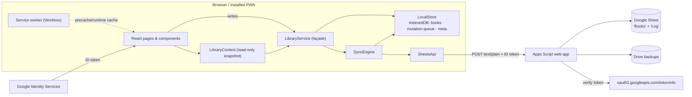

# Architecture

## The shape of the system



Strict layering, enforced by imports:

| Layer | Modules | May import |
| --- | --- | --- |
| Domain | `types/`, `lib/` | nothing app-specific (pure) |
| Data | `db/`, `data/` | domain |
| State | `state/`, `auth/`, `hooks/` | data, domain |
| UI | `components/`, `pages/` | state, domain — **never** `db/` or `fetch` |

`LibraryService` is the single seam between React and storage. Components read via
`useLibrary()` (a `useSyncExternalStore` snapshot) and write by calling the service
singleton. React knows nothing about IndexedDB or Google; the service knows nothing
about React.

## Offline-first data flow

**Write path** (`library.save`, `softDelete`, …):

1. Validate with the Zod schema (`lib/validate.ts`) — the same schema the form uses.
2. Write the full record to IndexedDB (`books` store) with a fresh `updatedAt`.
3. Enqueue a mutation in the `mutations` store. Queueing **coalesces**: repeated
   upserts of one book collapse to the latest snapshot; a delete supersedes queued
   upserts. An evening of offline edits becomes a handful of writes, not hundreds.
4. Notify subscribers (UI re-renders) and schedule a debounced sync.

**Sync** (`SyncEngine.sync`, also on `online`, tab focus, and every 90 s):

1. *Push:* drain the queue in batches of 40. The server applies each mutation under a
   script lock; an upsert only lands if its `updatedAt >=` the stored row's, otherwise
   the stored row comes back as a *conflict* and the client adopts it.
2. *Pull:* request rows changed since the last **server** timestamp (soft-delete
   tombstones included) and keep any that are newer than the local copy.
3. Record the server time as the new watermark — client clocks are never trusted for
   the cursor.

Both directions apply the same rule — **newest `updatedAt` wins** — so any number of
devices converge without coordination. For a single-owner library this is the honest
trade-off: a lost update requires editing the *same book on two devices within one
sync window*, every resolution is counted and visible in Settings, and layer-4 backups
(see [BACKUP_AND_RESTORE.md](BACKUP_AND_RESTORE.md)) cover even that.

## Security model

- **Authentication:** Google Identity Services issues a ~1 h ID token, held in
  `sessionStorage` only. Every backend call carries it in the body; Apps Script
  verifies it against Google's `tokeninfo` endpoint, checks the `aud` equals your
  OAuth client ID, requires a verified email, and matches it against the
  `OWNER_EMAILS` allowlist. Verified tokens are cached server-side for ≤5 minutes.
- **The “Anyone” web app** is reachable by anyone but usable by no one without your
  Google identity — reachability ≠ authorization.
- **Formula injection:** every cell range is set to plain-text number format (`@`)
  *before* values are written, so `=IMPORTRANGE(...)` in a book title is inert text.
  ISBNs keep their leading zeros for the same reason. CSV exports additionally prefix
  `= + - @` with `'` (OWASP CSV-injection guard) for safety in Excel.
- **XSS:** React escapes all text; the one user-controlled URL that is rendered (the
  cover) is schema-validated to `https:` or a small `data:image/*` payload — never
  `javascript:`, `http:` or arbitrary blobs. The Apps Script URL itself is validated
  against the `script.google.com/macros/s/…/exec` shape before it is ever used.
- **Secrets:** there are none in the client. The OAuth client ID is public by design;
  the script URL grants nothing by itself. Owner emails and the client-ID check live
  in Script Properties, server-side.
- **Transactionality:** all sheet writes happen under `LockService` and land as whole
  rows via single `setValues` calls; the audit `Log` sheet records who pushed what and
  when.

## Performance decisions

- Virtualized table (own 60-line hook) for large libraries; the card grid uses
  `content-visibility: auto` and lazy images instead.
- Search normalization is cached per book in a `WeakMap`; typing re-filters, never
  re-normalizes.
- SheetJS (Excel) and `qrcode` load via dynamic `import()` only when used.
- Covers are stored as ≤46 kB data URLs — zero image hosting, offline by construction,
  and safely inside a Sheet cell's 50 k-character limit.
- Workbox precaches the shell; remote covers are cache-first, metadata lookups
  network-first with cache fallback; the Apps Script API is deliberately never cached.

## Swapping Google Sheets out later

The UI and service layers depend only on this contract (see `data/api.ts`):

```ts
ping(): Promise<{ serverTime: string; bookCount: number }>
pull(since: string | null): Promise<{ books: Book[]; serverTime: string }>
push(mutations: Mutation[]): Promise<{ applied: string[]; conflicts: Book[]; serverTime: string }>
backupNow(): Promise<{ fileName: string }>
```

To move to Supabase/Postgres/Firestore: implement those four methods against the new
backend (a `books` table mirroring `types/book.ts`, the same newest-wins rule in
`push`), construct `SyncEngine` with it, and delete nothing else. `SyncEngine` already
accepts an injected implementation (`SyncApi`) — the test suite exercises the engine
against a fake backend exactly this way.

## Decision log

| Decision | Why | Trade-off accepted |
| --- | --- | --- |
| Hash routing | GitHub Pages has no rewrites; deep links must survive refresh & install | `#` in URLs |
| `text/plain` POST bodies | Apps Script can't answer CORS preflight | Slightly unusual, documented in both client & backend |
| ID token in body, verified per request | Apps Script can't read custom headers reliably across the redirect; verification is the real gate | One `tokeninfo` call per ~5 min (cached) |
| Newest-write-wins sync | Single owner, few devices; no server logic for merge UI needed | Simultaneous cross-device edits of one book: newest wins, counted & surfaced |
| Covers as small data URLs | Free, offline, no image host, survives inside a cell | ~380 px covers; large art isn't the goal |
| All sheet cells as text | ISBN leading zeros + formula-injection immunity + lossless round-trips | In-sheet arithmetic needs explicit conversion |
| Session-only tokens, re-prompt after ~1 h | Smallest credential surface | Occasional re-sign-in; the app keeps working locally meanwhile |
| PDF export = print stylesheet | Faithful, dependency-free, uses the OS "Save as PDF" | No programmatic PDF file |
| Own IndexedDB wrapper & virtual list | ~150 lines total, auditable, zero supply-chain surface | Fewer features than a library — none currently needed |
| Serial suggested client-side | Single owner; server sequence would add a round-trip | Two devices adding offline simultaneously could suggest the same serial (editable, non-key) |
